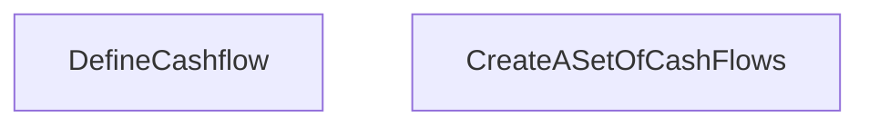

# Lifestream simulator
Everything should be expressable in simple strings, hopefully can modify directly in CLI.

Simulation should be visualized like cards, where decks are assembled ahead of time then drawn from. 

**TO REDUCE COMPLEXITY - ALL SIMS SHOULD BE ABLE TO BE PHYISCALLY REPRESENTED AS TABLE TOP CARD GAME**

Decks are textareas / csvs that can be modified

## Objective
A user can articulate which periods they would like a life event to be applied.

Decks represent constants which a life event can pull from 

** TODO(@leunte):  Will figure out mechanics how to apply constants from different decks to the period, order of operations for balances like saving, investment, debt, and other factors in the life event (in ECS this would be the components of the entity, where factors are part of the life event and the system applies in order). Entity is an ID, component is the data applied to that entity, system is the operation on those entities. The decks can be other entities as part of the environment **(keep everythign physically represented)**


## Use cases
```
College[2]
Kids[1-3]
```


## Notation
```
[1-3] is range
[1|3] is set

&& is AND
|| is OR

T is single
T[] is many

T() is description
```

### Timelines
Express as succinctly as possible timelines.

This is likely expressed as a decision graph? As all conditions are satisfied, emit.

Need logical operators to evaluate, AND OR (with nesting?). 

### Trigger criteria
These trigger an event that become an accumulator. If it can only trigger once, that should be clear. 

#### Most expressive
```
College[0-4]
```

#### SHorthnad
```
College // trigger once
College[] // trigger many
College[3] // trigger no more than 3
Kid // trigger once
Kid[] // trigger many
Kid[0-3] // trigger no more than 3
```

#### Probability
```
College
```

```
Exist,0,90 // empty flow, no variation should be produced
College,18,[21|22] // college inflation, negative cash flow 4-5years

Kid[],!Kid[0|1] && College[5->10]|Exist[30->35]
Kids,37-45 // boolean event, other events are dependent
Kids college,Kids[18],Kids[[21|22]]
Next Kid
Second Kid,
Senior Care,50
Retirement,35-65
Investment,

```
// how to express incrementals, like kids, houses, dollar? are these counters? or assets?


### Models
```
College,2.5e5
```

### Counters
Assets accumulated. Life events aren't assets!
```

```

### Decisions

## Mechanics
- Asset Trade
- Payment, Payout
- Affected by factors over time (so there needs to be a counter somewhere)
- Effects can be dependent on other counters

Given an asset, what will happen to it on the next period

Dependent or Nominal 

Asset In. 
Asset Out

## Life Events
All models are expressed as 'life events'. These events have a stream before/after they may occur. 

## UI Architecture
Only input is number of textareas, representing decks
Write the rules to define relationships of each deck. Can be dependent on each deck. 

Keep to the Cards metaphor as much as possible. There will likely need to be "counters" to indicate balances. Should this also be represented as a card?

No random. No dice. After the setup, all decks should be created and dealt. All simulation from there should be deterministic. No deck has to be exhausted to reshuffle, just create as long of a deck as required. This is a tie into information theory, where even if something is repeated, you can expand it and not express the information succinctly.


```typescript


```


