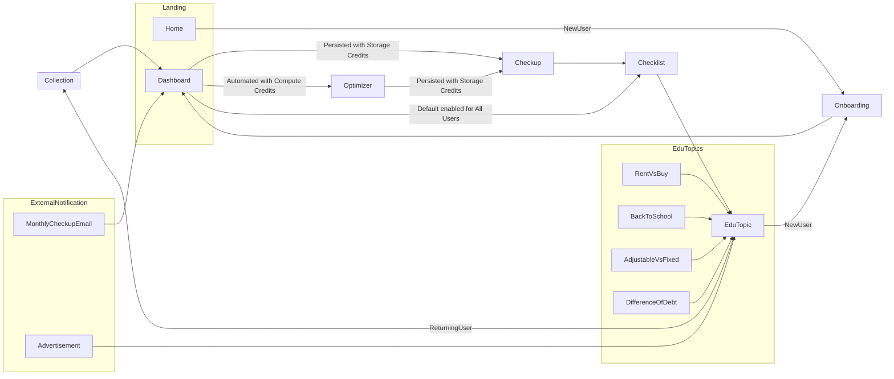

```mermaid
graph LR;

  subgraph Landing
    Home
    Dashboard
  end
  
  Dashboard-->|Persisted with Storage Credits|Checkup
  Dashboard-->|Automated with Compute Credits|Optimizer
  Optimizer-->|Persisted with Storage Credits|Checkup
  Checkup-->Checklist
  Dashboard-->|Default enabled for All Users|Checklist

  Home-->|NewUser|Onboarding
  
  Checklist-->EduTopic
  
  subgraph EduTopics
    EduTopic
    RentVsBuy-->EduTopic
    BackToSchool-->EduTopic
    AdjustableVsFixed-->EduTopic
    DifferenceOfDebt-->EduTopic  
  end  
  subgraph ExternalNotification
    MonthlyCheckupEmail;
    Advertisement-->EduTopic
  end
  MonthlyCheckupEmail-->Dashboard;
  EduTopic-->|ReturningUser|Collection;
  
  EduTopic-->|NewUser|Onboarding
  Onboarding-->Dashboard
  Collection-->Dashboard
  

  subgraph Collection
    
  end
  
  

    
```